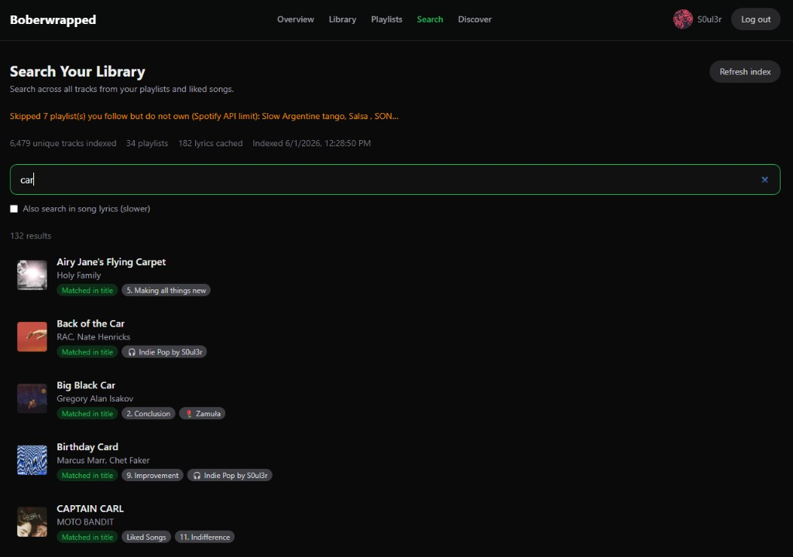

# Changelog

All notable changes to Boberwrapped are documented here.

## [Unreleased]

### Added — Library Search

Search across your entire saved library in one place:

- **Index builder** — Collects unique tracks from all playlists you own or collaborate on, plus Liked Songs (cached locally for 24 hours).
- **Instant metadata search** — Match by track title, artist, album, or playlist name (e.g. `car`, `rain`, `deszcz`).
- **Synonym expansion** — Related terms (e.g. `rain` → rainy, storm, deszcz) without AI.
- **Optional lyrics search** — Lazy-fetch lyrics via [LRCLib](https://lrclib.net/) (or optional Musixmatch API key) and search inside song text.
- **Result details** — Each hit shows why it matched and which playlist(s) it came from.

Playlists you follow but do not own are skipped (Spotify API limit); owned and collaborative playlists are included.

### Fixed

- **Spotify Feb 2026 API** — Playlist indexing uses `GET /playlists/{id}/items` instead of the deprecated `/tracks` endpoint (fixes 403 errors on owned playlists in Development Mode).
- **Turbopack root** — `next.config.ts` pins the project root so Tailwind resolves correctly when other `package-lock.json` files exist on the machine.

### Changed

- Redirect URI docs recommend `http://127.0.0.1:3000/callback` when Spotify blocks `localhost` in the Developer Dashboard.
