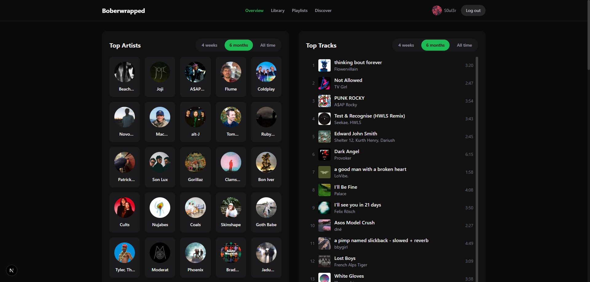

# Boberwrapped

Your Spotify listening stats, wrapped. Top artists, tracks, genres, audio features, playlists, and more — similar to [Last.fm](https://last.fm), powered by the [Spotify Web API](https://developer.spotify.com/documentation/web-api).

## Screenshot



## Features

- **Dashboard** – Top artists & tracks, top genres (from your tracks), time filters: **4 weeks**, **6 months**, **All time**
- **Audio features** – Mood profile radar (danceability, energy, valence, …) — may require Spotify extended access for new apps
- **Recently played** & **currently playing**
- **Library** – Liked tracks, saved albums, followed artists
- **Playlists** – List with track counts, detail view with tracks, create playlists from top tracks
- **Discover** – Recommendations from top artists/tracks — may require extended access

## Tech stack

- [Next.js 16](https://nextjs.org/) (App Router)
- TypeScript · Tailwind CSS · [Recharts](https://recharts.org/)
- Spotify Web API with **OAuth 2.0 PKCE** (no client secret in the browser)

## Prerequisites

- Node.js 18+
- A [Spotify Developer](https://developer.spotify.com/dashboard) app

## Quick start

```bash
npm install
cp .env.example .env.local
# Edit .env.local — set NEXT_PUBLIC_SPOTIFY_CLIENT_ID (and redirect URI if needed)
npm run dev
```

Open [http://localhost:3000](http://localhost:3000) and use **Log in with Spotify**.

## Spotify app setup (detailed)

1. Go to [developer.spotify.com/dashboard](https://developer.spotify.com/dashboard) and sign in.
2. **Create app**
   - **Name**: e.g. `Boberwrapped` (avoid names that start with “Spotify”).
   - **Description**: e.g. personal listening stats.
   - **Website** (optional): `http://localhost:3000` for local dev.
   - **Redirect URIs**: remove the default example and add:
     ```
     http://localhost:3000/callback
     ```
     Use `http://127.0.0.1:3000/callback` instead if you prefer — it must **exactly** match `NEXT_PUBLIC_SPOTIFY_REDIRECT_URI` in `.env.local` (localhost and 127.0.0.1 use different `sessionStorage`).
   - Enable **Web API** and accept the terms.
3. Save, then copy the **Client ID** (PKCE flow does not need the client secret in this app).

## Environment variables

| Variable | Description |
|----------|-------------|
| `NEXT_PUBLIC_SPOTIFY_CLIENT_ID` | Client ID from the Spotify dashboard |
| `NEXT_PUBLIC_SPOTIFY_REDIRECT_URI` | Must match a redirect URI registered on the app (default: `http://localhost:3000/callback`) |

Example `.env.local`:

```env
NEXT_PUBLIC_SPOTIFY_CLIENT_ID=your_client_id_here
NEXT_PUBLIC_SPOTIFY_REDIRECT_URI=http://localhost:3000/callback
```

Restart `npm run dev` after changing env vars.

## Production / deploy (e.g. Vercel)

1. In the Spotify app settings, add your production redirect URI, e.g. `https://your-domain.com/callback`.
2. Set the same values in your host’s environment variables for `NEXT_PUBLIC_SPOTIFY_CLIENT_ID` and `NEXT_PUBLIC_SPOTIFY_REDIRECT_URI`.

## Spotify API: extended access (new apps, ~Nov 2024)

Some endpoints are restricted for **new** or **development-mode** apps until you request access in the dashboard:

- **Audio features** (mood radar)
- **Recommendations** (Discover)
- Related artists, audio analysis, etc.

**What usually still works without extension:** top artists/tracks, library, playlists (owned/collaborative), recently played, profile.

1. Open your app in the [Developer Dashboard](https://developer.spotify.com/dashboard).
2. Use **Request extension** (or equivalent) for the APIs you need.
3. Wait for Spotify’s review.

## Troubleshooting

- **403 / Forbidden** on some features: add your Spotify account under **Settings → Users and Access** for apps in development mode; ensure you’ve re-authorized after scope changes (log out and log in again).
- **Playlist tracks empty** but Spotify shows songs: only playlists you **own** or **collaborate on** expose full track lists via the API; followed-only playlists may be limited.
- **`localhost` vs `127.0.0.1`**: use one host consistently with your redirect URI and when opening the app.

## Scripts

```bash
npm run dev      # development server
npm run build    # production build
npm run start    # run production build
npm run lint     # ESLint
```

## License

MIT (or adjust to your preference).
